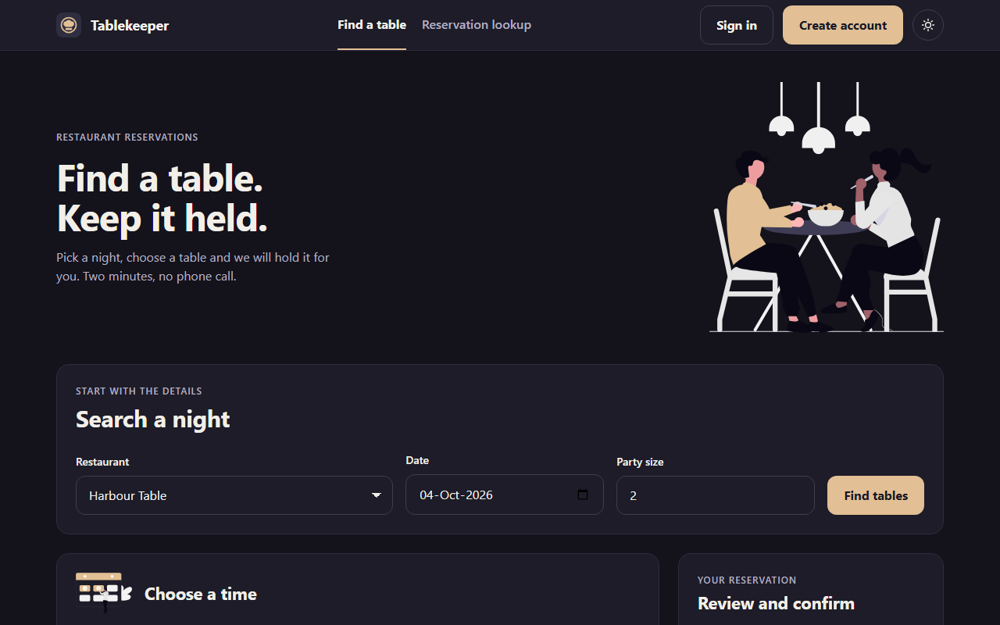

# Tablekeeper



A restaurant reservation service, built by four Claude Code agents working together in one BAND room. I'm Vivek, entering solo from Melbourne, in the Tablekeeper track of the WeAreDevelopers x BAND **Dark Factory** hackathon (26 Sep to 5 Oct 2026).

I sent four messages, one per stage, and the agents did the rest. Nobody wrote or edited code under `stage-1/` to `stage-4/`.

## Quick start

You need Docker and nothing else. From the repository root:

```sh
docker build -t tablekeeper stage-4
docker run --rm -p 8080:8080 -e PORT=8080 -e DEMO_SEED=1 tablekeeper
```

Open http://localhost:8080/ and sign in at `/login`. These two accounts exist only in the demo data.

| Email | Password | Use it for |
|---|---|---|
| `diner@df-demo.example` | `DemoPass-2026!` | Searching and booking. This account has a weekly series. |
| `manager@df-demo.example` | `DemoPass-2026!` | A combined-table booking, and Service recovery |

`stage-4/` is the finished product. Stages 1 to 3 are earlier milestones, frozen as they were accepted. Each folder has a `RUN.md`, and [stage-4/demo/DEMO.md](stage-4/demo/DEMO.md) has more on the demo data.

## What to try first

- Sign in as the diner and search Harbour Table. The "Window 1 + Window 2" row is a combined table.
- Open `/lookup` and paste in a booking reference.
- Flip the sun and moon control. Both themes are designed, not just inverted.
- Sign in as the manager, open **Service recovery** in the top bar, pick Harbour Table and a table to close for an evening. The preview shows which bookings move and where before you apply anything.

## How it was built

Four seats share one BAND room: a coordinator that plans and accepts, an implementer that builds the service, a frontend that owns every screen, and a reviewer that checks everything and never fixes. [FACTORY.md](FACTORY.md) covers the setup, what went wrong, time and cost. [room.json](room.json) is the full room log, 4,350 events, downloaded from BAND unedited. The seat mandates are in [mandates/](mandates/).

I ran the official harness myself after every stage, outside the factory.

| Stage | What it adds | Official checks |
|---|---|---|
| 1 | Reservations API: auth, idempotency, DST, export/import, atomic moves | 120 of 120 |
| 2 | Browser booking UI and combined tables | 25 of 25 |
| 3 | Booking policies, history, recurring reservations | 7 of 7 |
| 4 | Manager table-closure replanning and bulk amendment | 6 of 6 |

That is 158 checks with no failures, at revision `d268821`. A fresh `git clone` of this repo at `ca60ade` passes the same way. The whole run took about 7 h 40 min from first dispatch to last report. BAND shows $180 for the room, an estimate at list prices, and about 510M tokens across the four seats.

The git history is the agents' own commits, apart from the ones I made to add `room.json`, this README and `FACTORY.md`.

## Honest notes

- **Supplied inputs.** Before the run I prepared a read-only folder for the agents: a written visual brief, six reference screenshots, five illustrations and one icon. They copied the files unchanged. The details are in section 3 of [FACTORY.md](FACTORY.md).
- **Limits.** Accessibility got axe-core and manual keyboard checks, with no real screen reader. Screens were tested in headless Chromium only. The spec's 50 concurrent requests were not load-tested at that number. Recurring-series amendment has no screen and is API only. The official harness runs only part of the judging tests, so I can vouch for the shipped checks and nothing beyond them. [FACTORY.md](FACTORY.md) section 9 lists all of it.

## Assets

The illustrations come from [unDraw](https://undraw.co/license). I downloaded them by hand, they are free for commercial use, and they are used unchanged as artwork, not as training data. The Tablekeeper icon is original artwork that Claude drew for me from plain geometric shapes.
